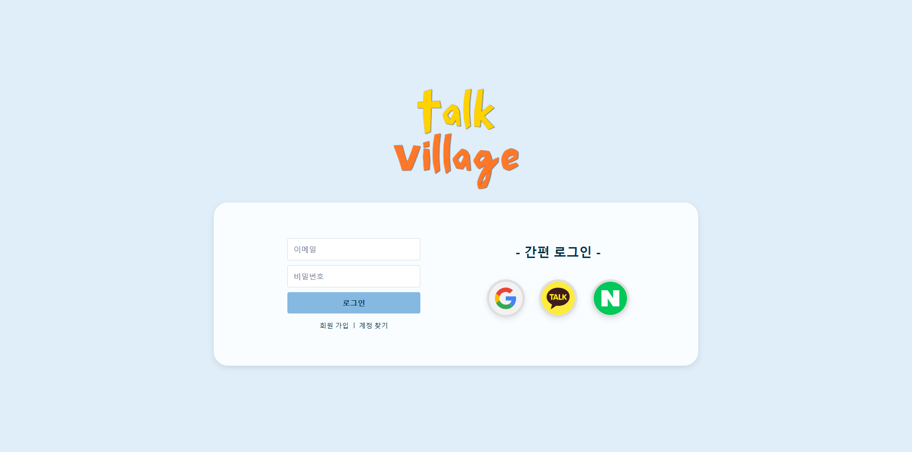

# TalkVillage

## 📋 프로젝트 소개
TalkVillage는 실용적인 영어 학습을 위한 온라인 플랫폼입니다. 일상생활에서 자주 사용되는 영어 표현과 문장을 효과적으로 학습할 수 있도록 다양한 기능을 제공합니다.

## 🎯 프로젝트 목표
- 실생활에 즉시 적용 가능한 영어 표현 학습
- 다양한 난이도와 테마별 학습 시스템 제공
- 게임을 통한 재미있는 영어 학습 경험 제공
- 멀티미디어 콘텐츠를 활용한 효과적인 학습

## ⚙️ 주요 기능
### 1. 사용자 인증
- 일반 회원가입 및 로그인
- OAuth2.0을 통한 소셜 로그인
- JWT 기반 인증

### 2. 학습 기능
- 초급/중급/고급 난이도별 학습 코스
- 테마별 학습 컨텐츠
- 영어 사전 검색
- 한영/영한 번역기

### 3. 학습 게임
- 3가지 유형의 학습 게임 제공
- 게임을 통한 복습 및 학습 강화

### 4. 멀티미디어 학습
- 영상을 통한 실용 영어 표현 학습
- 오디오 발음 가이드

## 🛠 기술 스택

### Frontend
- React 18
- TypeScript
- CSS Modules
- React Router DOM
- Axios
- Redux Toolkit
- Styled-components
- Material-UI (MUI)
- React Query

### Backend
- Java 17
- Spring Boot 3.3.4
- Spring Security
- Spring Data JPA
- Spring OAuth2
- Spring Mail
- JWT

### Database
- Oracle
- Redis (세션 관리)

### DevOps
- Git/GitHub
- Eclipse/STS4
- VS Code
- Postman
- Maven/Gradle
- Docker

### Communication
- Figma
- Notion
- Discord

## 📅 개발 일정
- 기획 및 설계 (2024.10.07 ~ 2024.10.21)
  - 요구사항 분석
  - DB 설계
  - UI/UX 와이어프레임 작성
- 개발 진행 (2024.10.22 ~ 현재)

## 📁 프로젝트 구조
tree
project-root/
├── frontend/
│ ├── src/
│ │ ├── components/
│ │ ├── pages/
│ │ └── services/
└── backend/
├── src/
│ ├── main/
│ │ ├── java/
│ │ └── resources/
└── test/

## 🔗 참고 링크
- [프로젝트 일정 관리](https://docs.google.com/spreadsheets/d/1pQr038dNQv4xL5-0lbYvoPQzIoPM32UMip8qP2c7dy8/edit?gid=341692253#gid=341692253)
- [트리 맵 & DB 구조](https://www.figma.com/board/koUMxarF5n0mSxBSjatcTu/ABproject?node-id=0-1&node-type=canvas&t=skZOlQCGoaTwyJQO-0)
- [와이어프레임](https://www.figma.com/design/RNqvxakhIIOkpxtgegwMQO/Framer-Wireframe-Web-UI-Kit-Features-by-PanoplyStore-(Community)?node-id=0-1&node-type=canvas&t=fXpAK5f6eLZlS0df-0)

## 📸 프로젝트 스크린샷

### 메인 화면 & 인증

> 이메일 로그인과 소셜 로그인(네이버, 카카오, 구글)을 지원하는 로그인 화면입니다.

> 이메일 인증을 통한 안전한 회원가입이 가능하며, 기본적인 사용자 정보를 입력받습니다.

> 사용자의 학습 진행도와 추천 학습 코스를 한눈에 볼 수 있는 대시보드 형태의 메인 화면입니다.

### 학습 기능

> 사용자의 레벨에 맞는 학습 코스를 선택할 수 있으며, 각 스테이지별 진행 상황을 확인할 수 있습니다.

> 실생활에서 자주 사용되는 영어 표현을 학습할 수 있으며, 발음 듣기와 예문 확인이 가능합니다.

> 학습한 단어와 표현들을 저장하고 복습할 수 있는 개인 맞춤형 단어장입니다. 중요도별 분류와 복습 기능을 제공합니다.

> 영어 단어와 표현을 실시간으로 검색할 수 있는 통합 사전 기능입니다. 발음, 예문, 유의어 정보를 제공합니다.

### 게임 & 마이페이지

> 학습한 단어들을 게임을 통해 재미있게 복습할 수 있는 게임 3가지 중 행맨 게임입니다. 점수 시스템을 통해 학습 동기를 부여합니다.

> 사용자의 프로필 정보, 학습 통계, 학습 기록 등을 확인하고 관리할 수 있는 마이페이지입니다.

